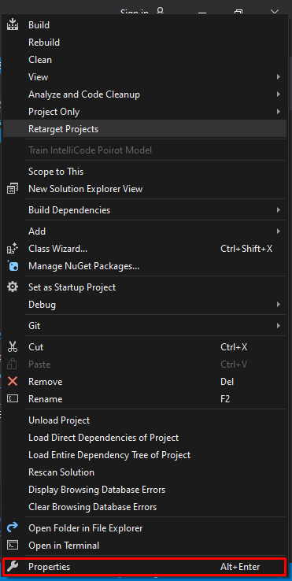
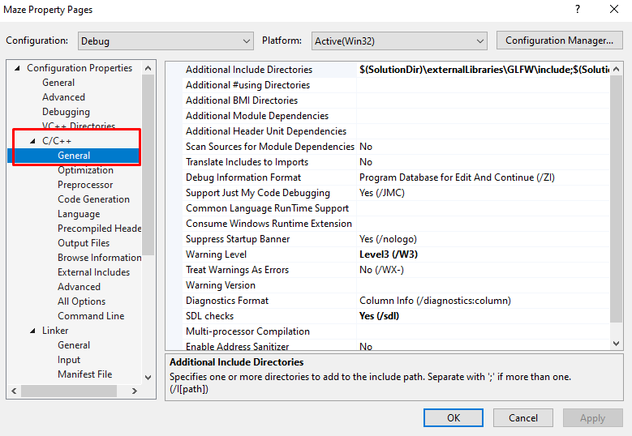
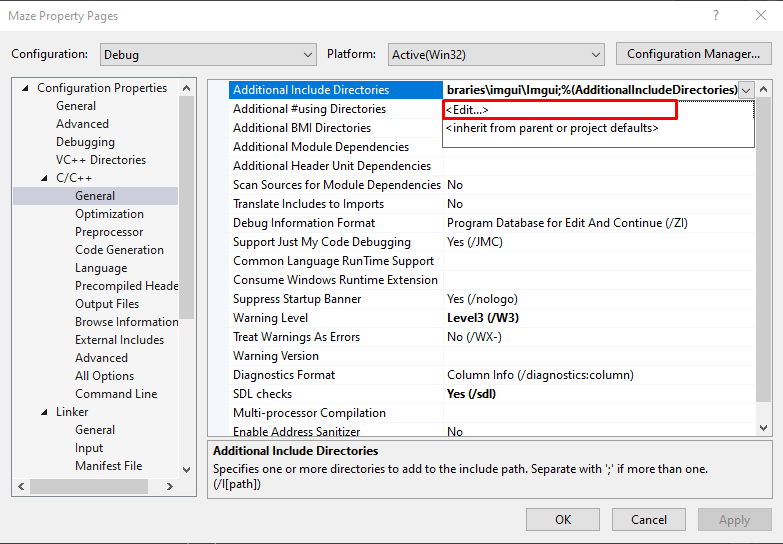
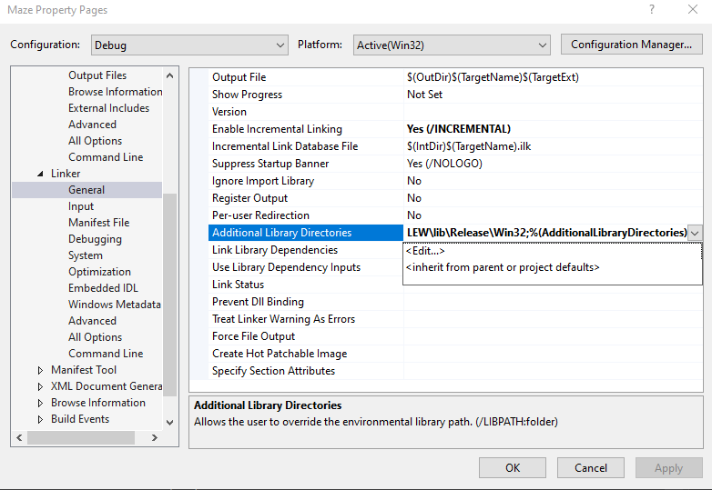
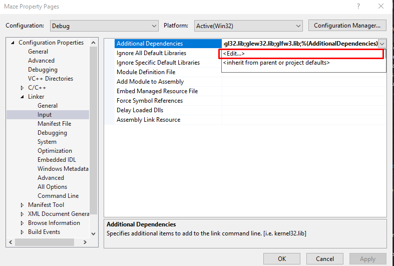

# Setting up include directories and linking libraries

1. Right click on `OPengl.sln` file and select `Properties`\
    \
    
    
2. In the `Properties` window, click on `C/C++` tab and click on `General` tab\
    \
  
3. In the `General` tab, click on `Additional Include Directories` and click on `Edit`\
    \
  
4. In the `Edit` window, add the following directories to the `Additional Include Directories`
    
  
```
$(SolutionDir)externalLibraries\GLFW\include
```
```
$(SolutionDir)externalLibraries\GLEW\include
```
```
$(SolutionDir)externalLibraries\GLM
```
```
$(SolutionDir)externalLibraries\stb_image
```
```
$(SolutionDir)externalLibraries\Assimp\include
```


5. In the `Properties` window, click on `Linker` tab and click on `General` tab
    
6. In the `General` tab, click on `Additional Library Directories` and click on `Edit`\
    \
   

7. In the `Edit` window, add the following directories to the `Additional Library Directories`

  ```
  $(SolutionDir)\externalLibraries\GLFW\lib-vc2019
  ```
  ```
  $(SolutionDir)\externalLibraries\GLEW\lib\Release\Win32
  ```
  ```
  $(SolutionDir)\externalLibraries\Assimp\lib
  ```
8. In the `Linker` tab, click on `Input` tab and click on `Additional Dependencies` and click on `Edit`\
\
   

9. Add the following libraries to the `Additional Dependencies`

    ```
    opengl32.lib
    glew32.lib
    glfw3.lib
    assimpd.lib
    ```

In all steps click on `Apply` and click on `OK` wherever necessary. 
